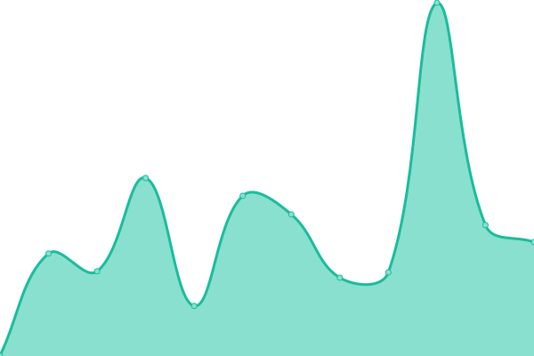

# [📈 Live Status](https://SiskoUrso.github.io/literate-octo-waddle): <!--live status--> **🟩 All systems operational**

This repository contains the open-source uptime monitor and status page for [SiskoUrso](https://SiskoUrso.github.io/literate-octo-waddle), powered by [Upptime](https://github.com/upptime/upptime).

With [Upptime](https://upptime.js.org), you can get your own unlimited and free uptime monitor and status page, powered entirely by a GitHub repository. We use [Issues](https://github.com/SiskoUrso/literate-octo-waddle/issues) as incident reports, [Actions](https://github.com/SiskoUrso/literate-octo-waddle/actions) as uptime monitors, and [Pages](https://SiskoUrso.github.io/literate-octo-waddle) for the status page.

<!--start: status pages-->
<!-- This summary is generated by Upptime (https://github.com/upptime/upptime) -->
<!-- Do not edit this manually, your changes will be overwritten -->
<!-- prettier-ignore -->
| URL | Status | History | Response Time | Uptime |
| --- | ------ | ------- | ------------- | ------ |
|  [Mastodon](https://mastodon.lanofthedead.xyz) | 🟩 Up | [mastodon.yml](https://github.com/SiskoUrso/literate-octo-waddle/commits/HEAD/history/mastodon.yml) | 

 1184ms
     
 | 

<a href="https://SiskoUrso.github.io/literate-octo-waddle/history/mastodon">93.16%</a>
    

|  [Lemmy](https://odin.lanofthedead.xyz) | 🟩 Up | [lemmy.yml](https://github.com/SiskoUrso/literate-octo-waddle/commits/HEAD/history/lemmy.yml) | 

 1517ms
     
 | 

<a href="https://SiskoUrso.github.io/literate-octo-waddle/history/lemmy">92.61%</a>
    

|  [PeerTube](https://apollo.lanofthedead.xyz) | 🟩 Up | [peer-tube.yml](https://github.com/SiskoUrso/literate-octo-waddle/commits/HEAD/history/peer-tube.yml) | 

 1121ms
     
 | 

<a href="https://SiskoUrso.github.io/literate-octo-waddle/history/peer-tube">92.73%</a>
    

|  [Pixelfed](https://kvasir.lanofthedead.xyz) | 🟩 Up | [pixelfed.yml](https://github.com/SiskoUrso/literate-octo-waddle/commits/HEAD/history/pixelfed.yml) | 

 1440ms
     
 | 

<a href="https://SiskoUrso.github.io/literate-octo-waddle/history/pixelfed">93.34%</a>
    

<!--end: status pages-->

[**Visit our status website →**](https://SiskoUrso.github.io/literate-octo-waddle)

## 📄 License

- Powered by: [Upptime](https://github.com/upptime/upptime)
- Code: [MIT](./LICENSE) © [SiskoUrso](https://SiskoUrso.github.io/literate-octo-waddle)
- Data in the `./history` directory: [Open Database License](https://opendatacommons.org/licenses/odbl/1-0/)
